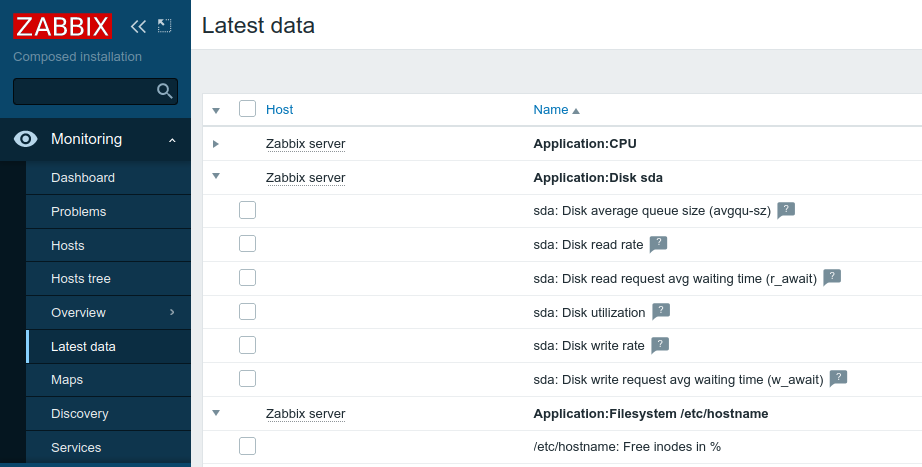

# zabbix-module-latest-data
Written according to Zabbix official documentation <https://www.zabbix.com/documentation/current/manual/modules>

A Zabbix 6.0 module to group items under Monitoring -> Latest data per Tag as it used to be with Application grouping in previous versions of Zabbix. See discussion [ZBX-19413: Zabbix 5.4: Latest data is broken in usability after UI migrating app > tag](https://support.zabbix.com/browse/ZBX-19413)

# How to use
1) Create a folder in your Zabbix server modules folder (by default /usr/share/zabbix/) and copy contents of this repository into that folder.
2) Go to Administration -> General -> Modules click Scan directory and enable the module. Go to Monitoring -> Latest data and check this out.

## Authors
See [Contributors](https://github.com/BGmot/zabbix-module-latest-data/graphs/contributors)
